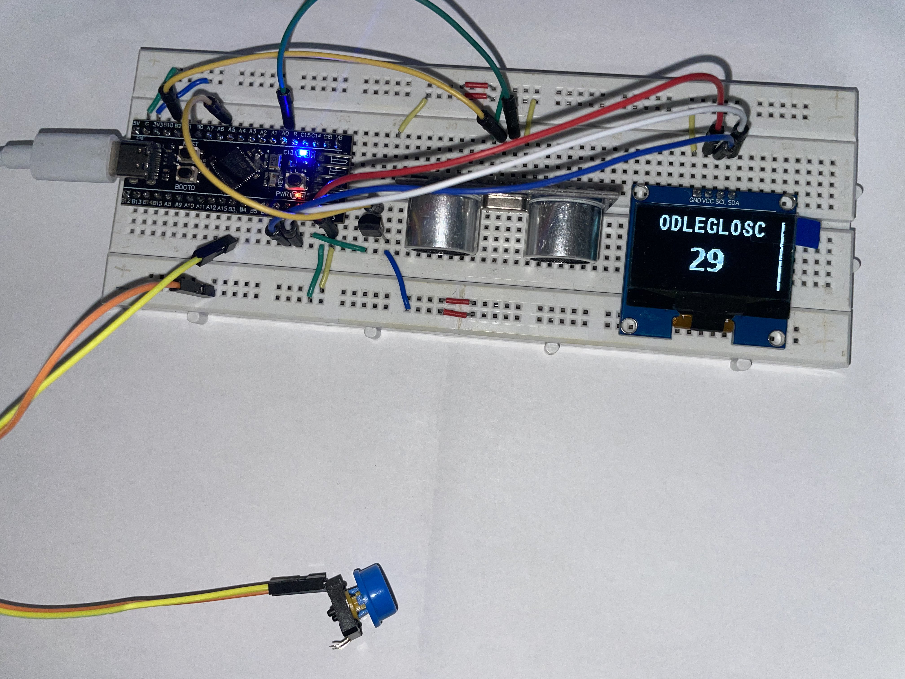

# Embedded System Project: Distance Measurement and Temperature Sensor Display

## Overview

This project implements a system that measures distance using an ultrasonic sensor and displays the results on an SSD1306 OLED screen. It also measures the temperature and calculates the speed of sound based on the temperature. The system utilizes an STM32 microcontroller to interface with various sensors and components.



## Features

- **Distance Measurement:** The system uses two input capture channels on the STM32 microcontroller to measure the time taken by an ultrasonic signal to travel. The distance is then calculated based on the speed of sound, which is influenced by the temperature.
- **Temperature Measurement:** The temperature is measured using the ADC (Analog-to-Digital Converter) of the STM32 microcontroller, and the speed of sound is adjusted based on the temperature value.
- **OLED Display:** The results are displayed on an SSD1306 OLED screen, showing the measured distance or temperature in centimeters.
- **User Interaction:** The system allows switching between distance measurement and displaying the temperature using a GPIO pin.

## Setup

### Hardware Requirements

- STM32 microcontroller (e.g., STM32F4 series)
- SSD1306 OLED display
- Ultrasonic distance sensor (e.g., HC-SR04)
- Temperature sensor (ADC-based)

### Software Requirements

- STM32CubeIDE for firmware development
- STM32 HAL Libraries

## Initialization

1. **GPIO:** Initialization of necessary GPIO pins.
2. **Timers:** Timers for Input Capture (IC) to measure the distance.
3. **ADC:** ADC initialization for temperature sensing.
4. **OLED Display:** Initialization and setup of the SSD1306 OLED display to show measurement results.

## Code Structure

1. **Main Code:**

   - Initializes necessary peripherals (GPIO, Timers, I2C, ADC).
   - Measures temperature and distance in an infinite loop.
   - Displays the results on the OLED screen.

2. **System Clock Configuration:**
   - Configures the system clock to ensure proper operation of the peripherals.

## Code Example

```c
MX_GPIO_Init();
MX_TIM2_Init();
MX_I2C1_Init();
MX_ADC1_Init();

// Display setup
SSD1306_Init();
SSD1306_GotoXY(5, 0);
SSD1306_Puts("POMIAR", &Font_11x18, 1);
SSD1306_UpdateScreen();
HAL_Delay(3000);

// Main loop
while (1) {
    // Temperature measurement
    HAL_ADC_Start(&hadc1);
    uint32_t adc_value = HAL_ADC_GetValue(&hadc1);
    float temp = adc_value * 330.0f / 4096.0f;
    float speed = 331.8f + 0.6f * temp;

    // Distance measurement
    uint32_t start = HAL_TIM_ReadCapturedValue(&htim2, TIM_CHANNEL_1);
    uint32_t stop = HAL_TIM_ReadCapturedValue(&htim2, TIM_CHANNEL_2);
    value = (stop - start) * speed / 20000;

    // Display measurement
    itoa(value, snum, 10);
    SSD1306_GotoXY(0, 30);
    SSD1306_Puts(snum, &Font_16x26, 1);
    SSD1306_UpdateScreen();

    HAL_Delay(1000);
}
```
